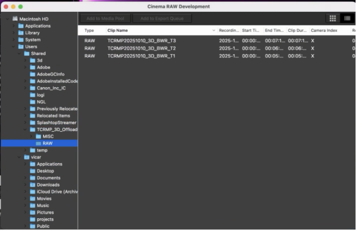
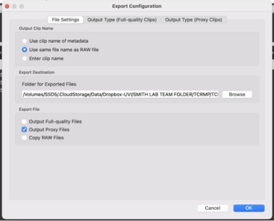
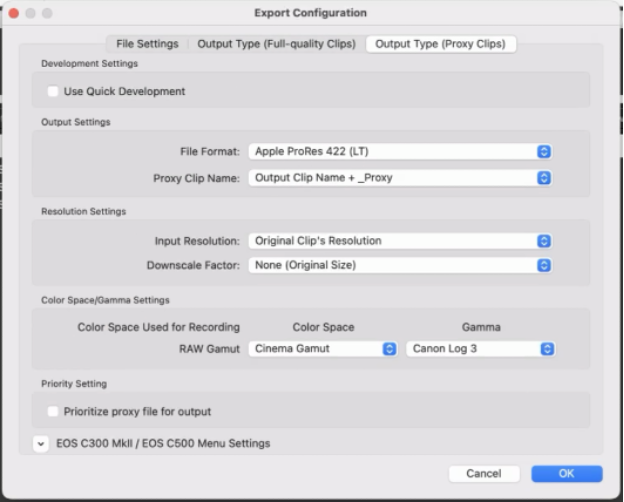

# 3D Modeling Procedure

This repository has two main parts:

1. **Automated Video-to-3D Pipeline:**
   A set of Python scripts that automate processing underwater video footage into high-quality 3D models using the Agisoft Metashape Python API. The workflow handles everything from image extraction, photogrammetry, and model export, with standardized centralized logging and documentation.
2. **Field Methods Guide:**
   Detailed procedures for data collection in the field, including camera setup, maintenance, and standard filming techniques

The workflow is designed for the Territorial Coral Reef Monitoring Program (TCRMP).

# Part 1: Automated Video-to-3D Pipeline

The processing step comes second, but is listed first since is the primary purpose of this repository.

## Requirements

- Agisoft Metashape Pro (v2.1.1 or later)
- Python 3.9 (for both local environment and Metashape compatibility)
- FFmpeg (for video frame extraction in Step 0)
- Required Python packages (specific versions in `requirements.txt`):
  - PyYAML
  - pandas
  - numpy
  - opencv-python
  - matplotlib
  - pillow
- **Note:** This pipeline has been developed and tested primarily on macOS & Linux. Compatibility on windows is not guaranteed.

## Project Structure

```
./
├── analysis_params.yaml          # Base analysis parameters template
├── docs/                         # Documentation files
│   ├── api_1july.txt            # API documentation
│   └── metashape_python_api_2_1_1.pdf
├── examples/                     # Example project directories (local)
├── images/                       # Supporting images (eg. for RMD rendering)
├── presets/                      # Software preset files
│   ├── lightroom/               # Adobe Lightroom presets
│   │   └── step0_lightroom_hdrphoto_r5c.xmp
│   └── premiere/                # Adobe Premiere presets
│       └── step0_premierepro_uhd_8k_23sept2024.epr
├── src/                          # Source code
│   ├── config.py                # Configuration loading utilities
│   ├── step0.py                 # Frame extraction
│   ├── step1.py                 # Initial 3D processing (most time-consuming)
│   ├── step2.py                 # Automatic scaling and validation
│   ├── step3.py                 # Dual model export (high-poly and low-poly)
│   ├── step4.py                 # (DEPRECATED) Final exports & web publishing
│   ├── legacy/                  # Legacy/archived scripts
│   └── utility/                 # Utility scripts
│       ├── enumerate_gpus.py    # GPU detection for Metashape
│       ├── file_naming.py       # Standardized file naming functions
│       ├── migrate_csv_to_new_format.py  # CSV format migration utility
│       ├── reset_full.py        # Complete project reset
│       ├── reset_step1.py       # Reset preserving Steps 0&1
│       └── reset_step2.py       # Reset preserving Steps 0-2
├── README.md                     # This documentation
└── requirements.txt              # Python package dependencies
```

## Setting up this Repository (1x per machine where want code to exist)

Clone this repository (or use cloned version in dropbox)

```bash
git clone https://github.com/laurenkolinger/3d.git
cd 3d
```

## Setting up a Project to be processed from Code in the Repo

A project is a single set of processing (eg 1 TCRMP season/day, 1 thesis project, 1 test set) where analysis parameters are the same.

### Create Project Directory Structure (1x per project)

set one shell Var and Reuse:

```bash
export PROJECT_DIR=/path/to/project
```

Create all necessary directories for your project:

```bash
# From the workspace root, create the required directories
mkdir -p $PROJECT_DIR/{video_source,processing,output}
```

This will create the following directory structure:

```
{PROJECT_DIR}/
├── video_source/                    # Input video files
├── processing/                      # Intermediate processing data
│   ├── frames/                      # Extracted frames (Step 0) - moved to output/frames/ in Step 3
│   ├── psxraw/                      # Initial PSX files (Step 1)
│   └── reportsraw/                  # Initial reports (Step 1)
└── output/                          # All final outputs
    ├── frames/                      # Completed frames (moved from processing/ in Step 3)
    │   └── {MODEL_ID}/              # Each model's frames
    ├── psx/                         # Individual model PSX files (Step 3)
    │   └── {MODEL_ID}.psx           # PSX with hipoly and lopoly chunks
    ├── orthomosaics/                # Orthomosaic outputs (Step 3)
    │   └── {MODEL_ID}/              # Each model in its own subdirectory
    │       ├── {MODEL_ID}_full.tif  # Full orthomosaic
    │       └── {MODEL_ID}_tile_*.tif # Tiled orthomosaics
    ├── models/                      # 3D model outputs (Step 3)
    │   └── {MODEL_ID}/              # Each model in its own subdirectory
    │       ├── {MODEL_ID}_hipoly.obj + texture    # High-poly model
    │       └── {MODEL_ID}_lopoly.obj + texture    # Low-poly model
    ├── reports/                     # Processing reports (Step 3)
    │   ├── {MODEL_ID}_hipoly.pdf    # High-poly processing report
    │   └── {MODEL_ID}_lopoly.pdf    # Low-poly processing report
    └── logs/                        # Processing logs
```

**Note on Frame Movement:** Frames start in `processing/frames/{MODEL_ID}/` after Step 0. During Step 3, after successful processing, frames are moved to `output/frames/{MODEL_ID}/`. This provides visual progress tracking - models with frames still in `processing/` are not yet processed through Step 3.

**Important:** Once this directory structure is created, do not rename or move the standard subdirectories (`video_source`, `processing`, `output`). The scripts rely on this specific structure. The only manual change expected within `{PROJECT_DIR}` after setup is adding your video files to the `{PROJECT_DIR}/video_source/` directory.

Copy and configure the analysis parameters file:

```bash
# Copy the base configuration file to your project
cp analysis_params.yaml $PROJECT_DIR/
```

The configuration file (`analysis_params.yaml`) located within your `{PROJECT_DIR}` contains all the settings for the project.

Make sure to:

1. Review and update the description and notes inside the `{PROJECT_DIR}/analysis_params.yaml` file.
2. Adjust any processing parameters within the `{PROJECT_DIR}/analysis_params.yaml` file as needed for your specific project.
3. Note that the primary input/output directory paths (`video_source`, `processing`, `output`, etc.) are derived automatically by the scripts based on the `{PROJECT_DIR}` you provide when running them.

### Local Environment Setup

Create a Python virtual environment in your project:

```bash
# Create virtual environment in project directory using Python 3.9
python3.9 -m venv $PROJECT_DIR/.venv

# Activate the virtual environment
source $PROJECT_DIR/.venv/bin/activate

# Install dependencies
pip install -r requirements.txt
```

## GPU Configuration

The pipeline provides fine-grained control over GPU usage for different processing stages through `analysis_params.yaml`:

### Main GPU Setting

```yaml
processing:
  use_gpu: true    # Enable GPU for photo alignment, depth maps, and mesh building
```

Controls GPU usage for:
- Photo matching and camera alignment
- Depth map generation
- 3D mesh building
- All primary photogrammetry operations

### Texture-Specific GPU Setting

```yaml
metashape:
  defaults:
    enable_texture_gpu: false    # Use CPU for texture generation
```

Controls GPU usage specifically for texture building. Set to `false` to avoid potential GPU memory issues during texture generation while still using GPU for other operations.

### Orthomosaic GPU Setting

```yaml
model_processing:
  enable_orthomosaic_gpu: true    # Use GPU for orthomosaic generation
```

Controls GPU usage for orthomosaic generation in Step 3.

**Recommended Settings:**
- High-end GPU (24GB+ VRAM): Set all to `true`
- Mid-range GPU (8-16GB VRAM): `use_gpu: true`, `enable_texture_gpu: false`, `enable_orthomosaic_gpu: true`
- Low-end GPU or CPU-only: Set all to `false`

**Note:** GPU control is managed through `Metashape.app.gpu_mask` and `Metashape.app.cpu_enable` global settings. The pipeline automatically saves and restores GPU state when temporarily disabling GPU for specific operations.

## Quick Start Guide

For experienced users who want a copy-paste command sequence. This assumes you've already cloned the repository.

### Complete Pipeline Run

```bash
# Set your project directory (change path as needed)
export PROJECT_DIR=examples/your_project_name/

# Create directory structure and setup
mkdir -p $PROJECT_DIR/{video_source,processing,output}
cp analysis_params.yaml $PROJECT_DIR/

# Setup Python environment
python3.9 -m venv $PROJECT_DIR/.venv
source $PROJECT_DIR/.venv/bin/activate
pip install -r requirements.txt

# MANUAL: Add your video files to $PROJECT_DIR/video_source/
# MANUAL: Edit $PROJECT_DIR/analysis_params.yaml with your settings

# Step 0: Extract frames (non-Metashape)
python src/step0.py $PROJECT_DIR

# Step 1: Initial 3D processing 
# PYTHONPATH=$PROJECT_DIR/.venv/lib/python3.9/site-packages /path/to/metashape-pro/metashape -r src/step1.py $PROJECT_DIR

PYTHONPATH=$PROJECT_DIR/.venv/lib/python3.9/site-packages /home/bizon/applications/metashape-pro_2_2_2_amd64/metashape-pro/metashape -r src/step1.py $PROJECT_DIR

# MANUAL: Open PSX files in processing/psxraw/ with Metashape GUI
# MANUAL: For each chunk: straighten model, rotate region to view, crop region to model

# Step 2: Automatic scaling and validation
#  PYTHONPATH=$PROJECT_DIR/.venv/lib/python3.9/site-packages   /path/to/metashape-pro/metashape -r src/step2.py $PROJECT_DIR

PYTHONPATH=$PROJECT_DIR/.venv/lib/python3.9/site-packages /home/bizon/applications/metashape-pro_2_2_2_amd64/metashape-pro/metashape -r src/step2.py $PROJECT_DIR

# MANUAL: Review status CSV - check Scale column for PASS/FAIL status
# MANUAL: For FAIL models, manually adjust scale bars in Metashape GUI, update CSV to PASS

# Step 3: Dual model export (high-poly, low-poly, orthomosaics)
# PYTHONPATH=$PROJECT_DIR/.venv/lib/python3.9/site-packages   /path/to/metashape-pro/metashape -r src/step3.py $PROJECT_DIR

PYTHONPATH=$PROJECT_DIR/.venv/lib/python3.9/site-packages /home/bizon/applications/metashape-pro_2_2_2_amd64/metashape-pro/metashape -r src/step3.py $PROJECT_DIR

# MANUAL: Review exported models and orthomosaics in output/ directory

# Step 4: Final exports and web publishing (future)
# Not yet implemented
```

### Platform-Specific Metashape Paths

**macOS:**
```bash
/Applications/MetashapePro.app/Contents/MacOS/MetashapePro
```

**Linux:**
```bash
/home/user/applications/metashape-pro_2_2_2_amd64/metashape-pro/metashape
```

### Utility Commands

```bash
# Reset entire project (back to before Step 0)
python src/utility/reset_full.py $PROJECT_DIR

# Reset after Step 1 (preserves extracted frames and initial PSX files)
python src/utility/reset_step1.py $PROJECT_DIR

# Reset after Step 2 (preserves frames, PSX files, and scaling)
python src/utility/reset_step2.py $PROJECT_DIR

# Migrate old CSV to new format (if updating from pre-Dec 2025 workflow)
python src/utility/migrate_csv_to_new_format.py $PROJECT_DIR/status_*.csv

# Check available GPUs
PYTHONPATH=$PROJECT_DIR/.venv/lib/python3.9/site-packages  /path/to/metashape-pro/metashape -r src/utility/enumerate_gpus.py
```

## Standardized File Naming

We use a clean, standardized naming system for all outputs:

- Model ID Format: All file names use the exact Model ID (e.g., `TCRMP20241014_3D_BWR_T2`)
- No Suffixes: Files are named simply as `{MODEL_ID}.ext`
- Organized Structure:
  - Orthomosaics and models get their own subdirectories: `output/orthomosaics/{MODEL_ID}/` and `output/models/{MODEL_ID}/`
  - Reports are flat in `output/reports/{MODEL_ID}_hipoly.pdf` and `{MODEL_ID}_lopoly.pdf`
  - Frames move to `output/frames/{MODEL_ID}/` after processing
- Dual Export: Step 3 produces both high-poly and low-poly models with textures and reports

**Example Output:**

```
output/
├── orthomosaics/
│   └── TCRMP20241014_3D_BWR_T2/
│       ├── TCRMP20241014_3D_BWR_T2_full.tif
│       └── TCRMP20241014_3D_BWR_T2_tile_*.tif
├── models/
│   └── TCRMP20241014_3D_BWR_T2/
│       ├── TCRMP20241014_3D_BWR_T2_hipoly.obj
│       ├── TCRMP20241014_3D_BWR_T2_hipoly.tif  # texture
│       ├── TCRMP20241014_3D_BWR_T2_lopoly.obj
│       └── TCRMP20241014_3D_BWR_T2_lopoly.tif  # texture
└── reports/
    ├── TCRMP20241014_3D_BWR_T2_hipoly.pdf
    └── TCRMP20241014_3D_BWR_T2_lopoly.pdf
```

## Workflow Overview

The complete processing workflow consists of the following steps:

1. **Frame Extraction** (step0.py): Extract frames from video footage
2. **Initial 3D Processing** (step1.py): Process extracted frames to create initial 3D models
3. **Manual Quality Check**: Review model quality (manual step)
4. **Manual Straightening**: Straighten and crop models in Metashape (manual step)
5. **Automatic Scaling** (step2.py): Detect targets, add scale bars, validate accuracy
6. **Dual Model Export** (step3.py): Export high-poly and low-poly models with orthomosaics
7. **Manual Review**: Check exported models and orthomosaics (manual step)
8. **Final Exports & Web Publishing** (step4.py): Create final exports and upload to Sketchfab

**Note:** Each script will prompt for the project directory containing the `analysis_params.yaml` file if not provided as a command-line argument. This allows processing different projects without code modifications, as source files will be linked to individual project directories dynamically for each run.

**Note about Running Metashape Scripts (Steps 2-4)**

To run Metashape scripts with the correct Python environment, you'll need to set the PYTHONPATH to point to your virtual environment's site-packages. This ensures Metashape uses the packages from your virtual environment while maintaining compatibility with Metashape's Python 3.9.

The general format for running Metashape scripts is:

```bash
PYTHONPATH=$PROJECT_DIR/.venv/lib/python3.9/site-packages /Applications/MetashapePro.app/Contents/MacOS/MetashapePro -r src/stepX.py $PROJECT_DIR
```

Where `stepX.py` is the specific step you want to run (step1.py, step2.py, etc.) and `{PROJECT_DIR}` is the path to your project directory containing `analysis_params.yaml`.

## Detailed Workflow

### Step 0: Frame Extraction (Non Metashape)

Extracts frames from video footage at a specified rate.

```bash
python src/step0.py $PROJECT_DIR
```

Scans `video_source/` for videos, extracts frames to `processing/frames/`, and creates tracking CSV files.

### Step 1: Initial 3D Processing (Most Time-Consuming)

Performs initial 3D reconstruction using extracted frames. Creates batched PSX files with multiple models grouped for efficiency.

```bash
PYTHONPATH=$PROJECT_DIR/.venv/lib/python3.9/site-packages /Applications/MetashapePro.app/Contents/MacOS/MetashapePro -r src/step1.py $PROJECT_DIR
```

Groups models into batches, aligns cameras, builds depth maps, creates 3D models with textures, and saves to `processing/psxraw/`.

### Manual Step: Straightening & Scaling Preparation

After Step 1, manually straighten each model in preparation for automatic scaling:

1. Open each PSX file in `processing/psxraw/` with Metashape
2. For each chunk in the project:

   **Straightening (always required):**

   - Load the textured model
   - Auto-adjust brightness and contrast in one of the images to improve texture
   - Switch to rotate model view
   - Rotate the model so it aligns horizontally at the top of the view
   - Use "Model > Region > Rotate Region to View" to set the alignment
   - Resize the region to "crop" to the model area (use top XY and side views)
   - Use the rectangular crop tool to crop to the model area bounded by the region

   **Scaling Preparation:**

   - Ensure coded targets are visible and properly positioned in the model
   - Verify at least 2 scale bars worth of targets are clearly visible

3. Save the project and quit Metashape

### Step 2: Automatic Scaling and Validation

Automatically detects coded targets, applies scale bars, and validates scale accuracy.

```bash
PYTHONPATH=$PROJECT_DIR/.venv/lib/python3.9/site-packages /Applications/MetashapePro.app/Contents/MacOS/MetashapePro -r src/step2.py $PROJECT_DIR
```

**What it does:**

- Removes small disconnected components
- Detects circular 20-bit coded targets
- Removes markers not in scale_bars list (cleanup)
- Adds scale bars from analysis_params.yaml
- Applies scaling transformation
- Calculates scale error and validates against threshold
- Marks chunks as Scale=PASS or Scale=FAIL in status CSV

**Check results:** Review the status CSV `Scale` and `Scale Error (m)` columns to see which models passed validation.

### Step 3: Dual Model Export (High-Poly and Low-Poly)

Processes Scale=PASS models to generate production-ready outputs with both high-resolution and optimized low-poly versions.

```bash
PYTHONPATH=$PROJECT_DIR/.venv/lib/python3.9/site-packages /Applications/MetashapePro.app/Contents/MacOS/MetashapePro -r src/step3.py $PROJECT_DIR
```

**What it does:**

For each Scale=PASS chunk:
1. **High-Poly Export:**
   - Exports full-resolution model with texture
   - Generates processing report
2. **Low-Poly Creation:**
   - Duplicates chunk
   - Decimates mesh by configured factor (default: 10x reduction)
   - Reduces camera overlap for efficiency (target: 3 cameras per point)
   - Rebuilds UV mapping
   - Regenerates texture (using CPU if configured)
   - Exports low-poly model with texture and report
3. **Orthomosaic Generation:**
   - Builds full orthomosaic (single TIFF)
   - Generates tiled orthomosaic (0.5m blocks)
4. **PSX Save:**
   - Saves PSX with both hipoly and lopoly chunks to `output/psx/{MODEL_ID}.psx`
5. **Frame Movement:**
   - Moves frames from `processing/frames/{MODEL_ID}/` to `output/frames/{MODEL_ID}/`
   - Updates all camera photo paths in the PSX file to point to new relative locations
   - Uses relative paths (`../frames/{MODEL_ID}/`) so PSX and frames can be moved together
6. **Tracking Update:**
   - Marks as Scale=DONE in status CSV

**Outputs:**
- `output/models/{MODEL_ID}/{MODEL_ID}_hipoly.obj` + texture (.tif)
- `output/models/{MODEL_ID}/{MODEL_ID}_lopoly.obj` + texture (.tif)
- `output/orthomosaics/{MODEL_ID}/{MODEL_ID}_full.tif`
- `output/orthomosaics/{MODEL_ID}/{MODEL_ID}_tile_*.tif` (multiple tiled files)
- `output/reports/{MODEL_ID}_hipoly.pdf`
- `output/reports/{MODEL_ID}_lopoly.pdf`
- `output/psx/{MODEL_ID}.psx` (saved project with both hipoly and lopoly chunks)
- `output/frames/{MODEL_ID}/` (moved frames with updated paths in PSX)

**Frame Management:** After Step 3 completes, frames for processed models are in `output/frames/`, while unprocessed models still have frames in `processing/frames/`. This provides visual progress tracking.

**GPU Usage:** Controlled by `enable_texture_gpu` and `enable_orthomosaic_gpu` settings in analysis_params.yaml.

### Manual Step: Model Review and Touchups

After Step 3, manually review the exported models:

1. Review high-poly and low-poly models in external 3D viewer
2. Check orthomosaic quality (full and tiled versions)
3. Review processing reports for any issues
4. If corrections needed, adjust in Metashape GUI and re-export

### Step 4: Web Publication (DEPRECATED)

**This step is deprecated and no longer used in the workflow.**

Step 3 now produces the final outputs:
- High-poly models: `output/models/{MODEL_ID}/{MODEL_ID}_hipoly.obj`
- Low-poly models: `output/models/{MODEL_ID}/{MODEL_ID}_lopoly.obj`
- Orthomosaics: `output/orthomosaics/{MODEL_ID}/`

The step4.py script previously handled:
- Further decimation for web viewing
- Sketchfab upload
- High-resolution archival exports

These features may be re-implemented in the future if needed, but Step 3 outputs are considered the final production-ready assets.

### Step 5: Output Migration (Future)

**Under development**

Workflow for consolidating multiple project runs:

- Migrate output/ contents to master collection folder
- Append status CSV to master tracking database
- Maintain processing provenance across runs

## Utility Scripts

These scripts provide helpful utilities for managing the processing environment.

### `src/utility/reset_full.py`

**Complete Project Reset** - Resets project to **BEFORE Step 0** (frame extraction).

**What it does:**

- Empties `processing/` and `output/` directories completely
- Keeps empty folder structure (`processing/`, `output/` directories remain)
- Removes all tracking CSV files
- Preserves: `video_source/`, `analysis_params.yaml`, `.venv/`

**Usage:**

```bash
python src/utility/reset_full.py /path/to/project
```

**When to use:** Starting completely over from the beginning (frame extraction).

### `src/utility/reset_step1.py`

**Reset After Step 1** - Preserves Steps 0 & 1, clears Steps 2+ outputs.

**What it PRESERVES (the time-consuming work):**

- Step 0: Extracted frames (`processing/frames/`)
- Step 1: PSX files (`processing/psxraw/`)
- Step 0 & Step 1 tracking status

**What it CLEARS:**

- Step 2+: All `output/` directory contents
- Step 2+ tracking status (resets to "Step 1 complete")

**Usage:**

```bash
python src/utility/reset_step1.py /path/to/project
```

**When to use:** Re-running Step 2 (automatic scaling) and subsequent steps while preserving hours of Step 0 & Step 1 processing time.

### `src/utility/reset_step2.py`

**Reset After Step 2** - Preserves Steps 0-2, clears Steps 3+ outputs.

**What it PRESERVES:**

- Step 0: Extracted frames (`processing/frames/`)
- Step 1: PSX files (`processing/psxraw/`)
- Step 2: Scaling data (Scale=PASS status in tracking and PSX files)
- All logs

**What it CLEARS:**

- Step 3+: Models, orthomosaics, reports, output PSX files
- Step 3+: Moved frames (from `output/frames/`)
- Step 3+ tracking status
- Resets Scale from "DONE" back to "PASS" (ready to re-export)

**Usage:**

```bash
python src/utility/reset_step2.py /path/to/project
```

**When to use:** Re-running Step 3 (model export) with different settings while preserving hours of Steps 0-2 processing time. Useful for testing different decimation factors, texture settings, or orthomosaic parameters.

### `src/utility/migrate_csv_to_new_format.py`

**Migrate Old CSV to New Format** - Adds new tracking columns to existing CSV files.

**What it does:**

- Adds 3 new columns: `Scale`, `Scale Error (m)`, `Cameras Removed`
- Creates timestamped backup of original CSV
- Preserves all existing data
- Verifies migration succeeded

**Usage:**

```bash
python src/utility/migrate_csv_to_new_format.py /path/to/old_status.csv
```

**When to use:** When applying the new streamlined workflow to projects that were processed with the old workflow version (pre-December 2025).

### `src/utility/enumerate_gpus.py`

This Python script lists the available GPUs that Metashape can detect and use. This is useful for verifying GPU configuration and ensuring Metashape is utilizing the expected hardware acceleration.

**Usage:**

```bash
# Run using Metashape's Python environment
/Applications/MetashapePro.app/Contents/MacOS/MetashapePro -r src/utility/enumerate_gpus.py
```

## Troubleshooting

### Common Issues

1. **Package Import Errors in Metashape**

   If you encounter import errors for packages like numpy, pandas, or PyYAML when running scripts through Metashape, you'll need to install these packages in Metashape's Python environment. Use the provided installation scripts:

   ```bash
   # On macOS/Linux
   ./src/legacy/install_metashape_deps.sh
   ```
2. **PSX files not generated**

   Ensure that the `psxraw` directory exists and is writable. Check the log file in the `reports` directory for error messages.
3. **"Module 'numpy' has no attribute 'bool'"**

   This error typically occurs with incompatible numpy versions. Use our installation scripts to install the compatible version in Metashape's Python environment.
4. **Metashape Python version mismatch**

   If your Metashape version uses a different Python version than 3.9, you may need to modify the installation scripts to point to the correct Python interpreter.

# Part 2: Field Methods Guide

## Required Materials

- Camera system:

  - Camera with lights
  - Memory card (CF Express)
  - Camera housing
  - External battery pack
  - Strobe light batteries
  - Camera lens
  - Cinema camera gear
  - Handle with clips and rope
- Field equipment:

  - Scale bars (2)
  - Field box containing:
    - Extra towels
    - O-ring grease
    - Cleaning materials
    - Dry towels
  - Slate
  - Vacuum device for housing seal check

## Camera Setup and Maintenance

### Regular Maintenance

- Camera cinema gear maintenance
- Camera settings verification
- Programmable button configuration
- Housing maintenance (every few weeks or if leaks detected):
  - O-ring greasing

### Pre-Dive Preparation

1. Day before:

   - Check housing and o-rings
   - Charge camera
   - Charge external battery pack
   - Charge strobe light batteries
   - Initialize media on memory card
2. Morning of:

   - Camera sealing procedure:

     1. Install battery and memory card
     2. Attach lens and verify autofocus is on
     3. Remove lens cap and check for smudges
     4. Prepare housing for camera insertion
     5. Seat camera in housing using cinema camera gear
     6. Connect external battery
     7. Final housing checks:
        - Turn on alarm
        - Check for smudges on housing lens
        - Verify o-ring condition
        - Close housing
        - Use vacuum device until light turns green
   - Equipment verification:

     - Camera and memory card
     - Housing
     - Field box with supplies
     - Slate
     - Scale bars (2)
     - Handle with clips and rope
   - Camera settings verification:

     - CP file: C2 (Canon log 3 / C.Gamut Color matrix neutral)
     - Sensor mode: full frame
     - Frequency: 59.94hz
     - Recording: RAW LT
     - Destination: CFexpress
     - Frame rate: 59.94 fps

## In-Water Procedures

### Start of Dive

1. **B**uttons: Press all buttons to prime them
2. **P**ower:
   - Turn on camera and lights (for Kraken lights, hold in/out buttons 1s, press middle button)
   - Put lights to sleep (hold center 2s)
3. **L**eaks: Monitor green light - if turns red, return to boat

### Transect and Camera Setup

1. **S**cale bars:

   - Place at each end of transect
   - One scale bar shoudl be ~ ~45 deg angle to transect, another parallel to transect. They should be set in a place where they will not move or wobble at all.
   - Ensure circular targets are **visible** in footage and that scale bars **never move** during filming
   - If scale bars move / get moved before filming ends, the film is useless, and needs to be redone (restart filming right away if time / gas allows).
2. **T**ime code: Reset (Mode button)

   - this helps reset time code to zero, so can keep proper time.
3. **A**rms: Extend to position lights as far apart as possible
4. **L**ights: Turn on (for Kraken lights, hold Center Button 2 sec)
5. **W**hite balance: Press Button 13, hold camera over white part of scale bar
6. **E**xposure:

   - you should see wave form manager (WFM) on the screen. If not, press "Disp" to cycle through menu, or press button 6 to open WFM
   - Use ISO dial (top of camera, next to vacuum valve) to slightly overexpose (peaks should barely exceed 100% on WFM). ISO should ideally be < 10000 to avoid noisy footage
7. **A**ltitude:

   - Position camera so viewfinder covers length of scale bar
   - Note the altitude (height off bottom) of camera when viewing entire viewfinder (should be ~70cm)
   - Maintain this altitude throughout filming
8. **R**ecord:

   - Press Record button
   - Show transect number

### Filming Protocol (4-Pass Method)

Each pass should be approximately 10 meters long and take about 1 minute, maintaining consistent altitude.

1. **Pass 1**:

   - Start at one end
   - Camera facing straight down
   - Transect line visible in left quarter of viewfinder
2. **Pass 2**:

   - Turn around
   - Camera facing straight down
   - Position slightly away from transect line
   - Viewfinder should see 1m distance from transect
   - Maintain ~0.5m overlap with Pass 1
   - Position approximately arm's length from transect
3. **Pass 3 & 4**:

   - Move ~20cm from pass 1/2 position
   - Tilt camera 45°
   - Capture angled view of transect from either side

After filming transect, if using Krakens, press center button on each light for 2s to put lights to sleep. If using Keldans, turn dial to off.
After dive, Turn off Krakens (hold inner and outer buttons for 2s) or KEldans, turn dial to off, lock. Turn off camera.

## Offloading memory card each day

(coming soon)

## Encoding CRAW video

(coming soon)






